# WRITE UP

**Challenge:** AN.apk

Install app và mở lên thì không thấy gì hiển thị cả:

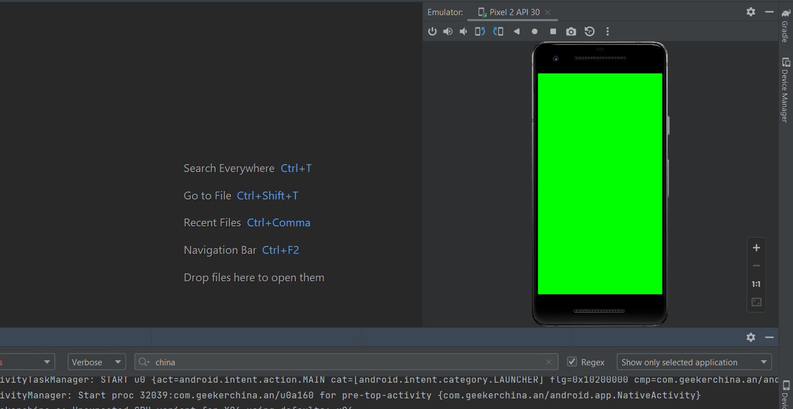

Kiểm tra logcat ta nhận được dòng chữ “Nice, Go on! ctfer”

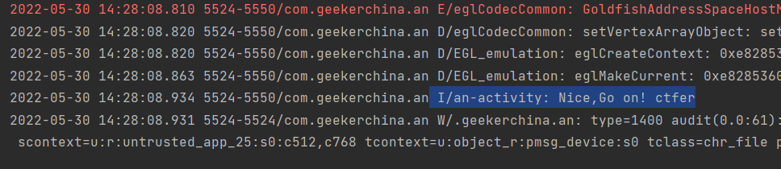

Sử dụng JD-GUI để check souce và cũng không nhận được bất kỳ mã code nào:

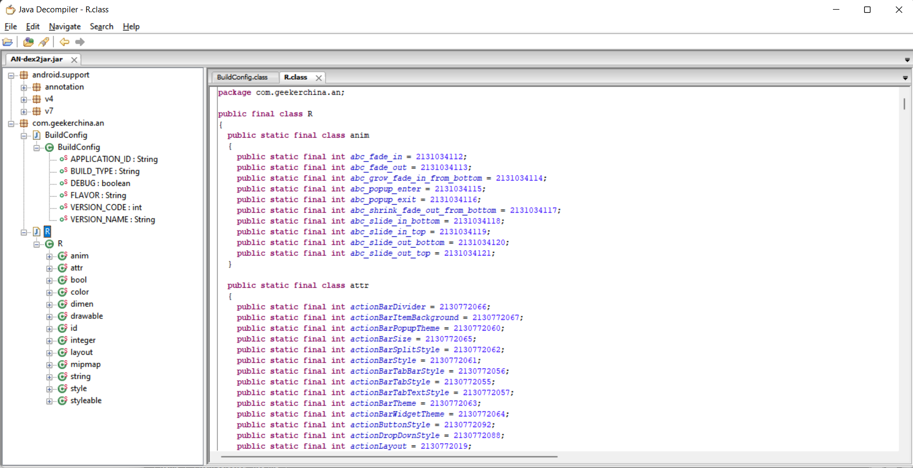

Sử dụng apktool để decompile AN.apk ra folder, ta check file AndroidManifest.xml:

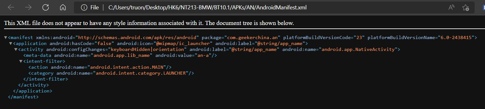

Ở atrribute android:name="android.app.NativeActivity", từ đó có thể biết được app không hề có mã từ class com.geekerchina.an mà nó sẽ sử dụng native code ([NativeActivity - Android SDK | Android Developers (mit.edu)](https://www.mit.edu/afs.new/sipb/project/android/docs/reference/android/app/NativeActivity.html)).

Ở thẻ meta-data, ta thấy

&lt;meta-data android:name="android.app.lib\_name" android:value="an-a"/&gt;

Như vậy, có vẻ như AN.apk sẽ load một thư viện nào đó lên để có thể chạy app. Sử dụng apktool để decompile source ra folder:

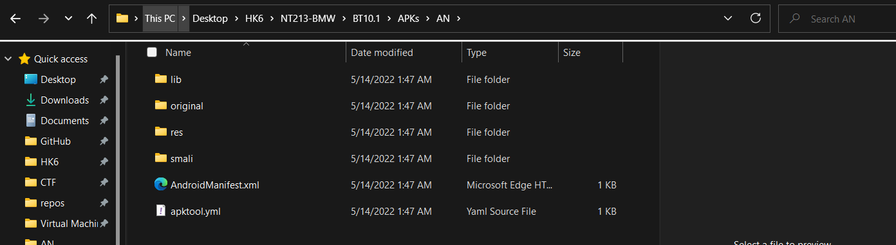

Vào lib/armeabi ta thấy có file .so, check file:

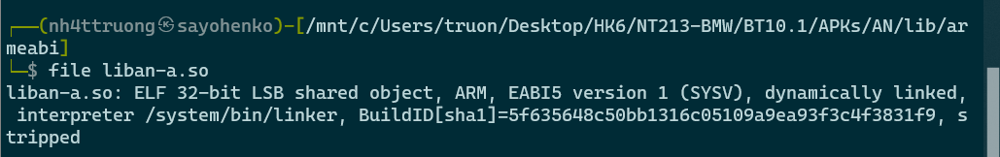

Với .so file này, ta sử dụng IDA 32 bit để view source:

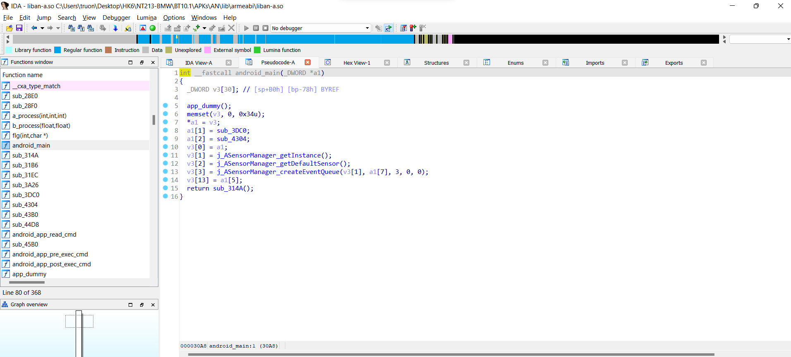

Ở hàm sub\_314A(), ta có thể biết được cách thức mà app sẽ cho flag:

\- Dòng 200, 201:

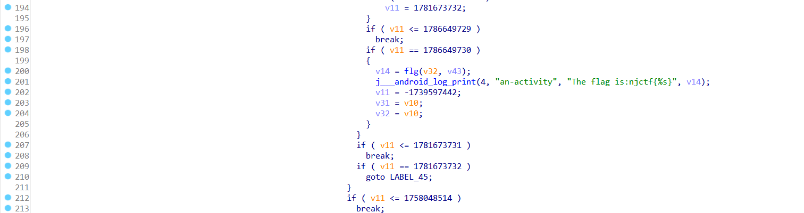

\- Dòng 418, 419:

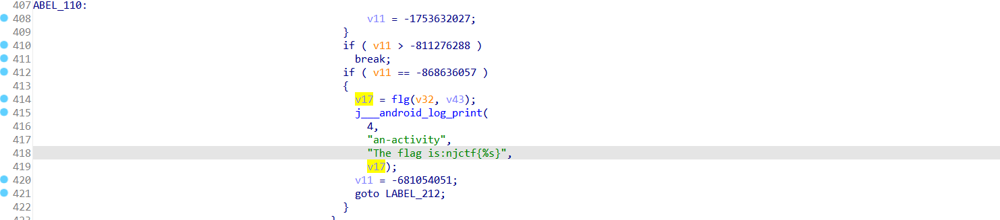

Cả 2 chỗ trễ đều cho ra flag bằng cách đọc từ hàm **flg(v32, v43)**, check hai biến v32, v43 và hàm flg():

\- v32 là một giá trị int và v43 là một mảng char 28 ký tự, có thể v43 sẽ là nơi lưu trữ flag:

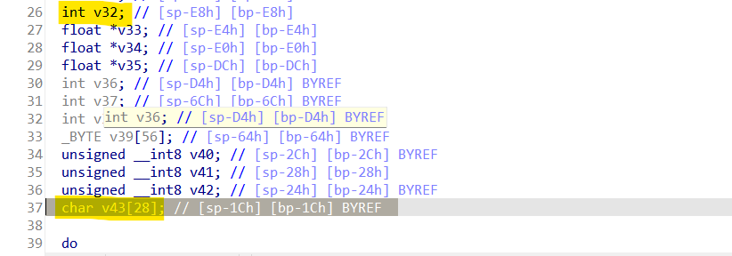

\- Hàm flg():

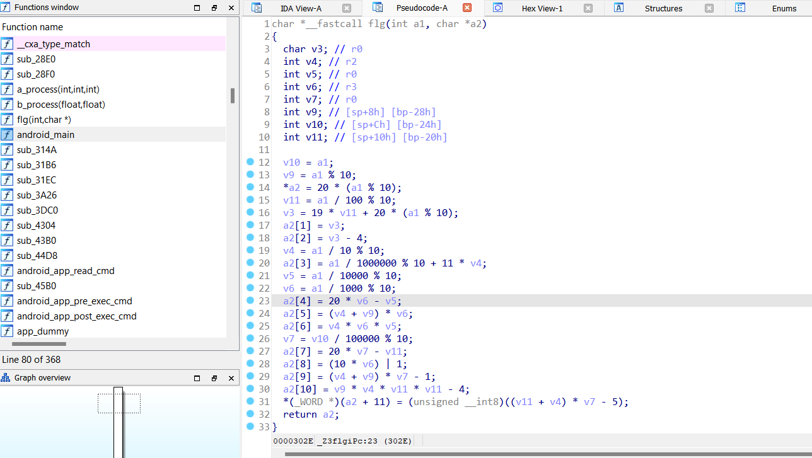

Từ đó, ta có thể xác định đây là một lib có sử dụng kỹ thuật obfuscation để làm rối mã. Cụ thể, để có thể get được flag từ hàm flg(v43, v32) thì ta phải move qua nhiều vòng lặp while và cả label Không thể RE được. Từ đó, ta cần xác định theo hướng ngược lại là đi từ hàm flg() đi ra.

Trong hàm flg(), ta cần 2 tham số là v43 là một integer và một v32 là mảng char (size == 28). Tham số v43 đúng vai trò là một số để hàm flg() đọc được để convert sang ASCII.

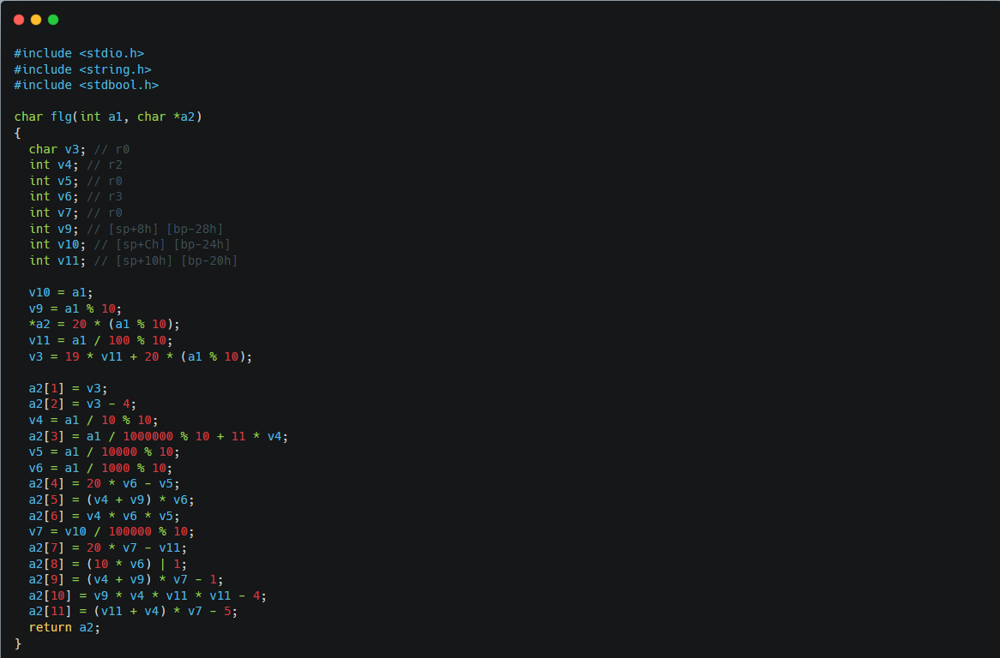 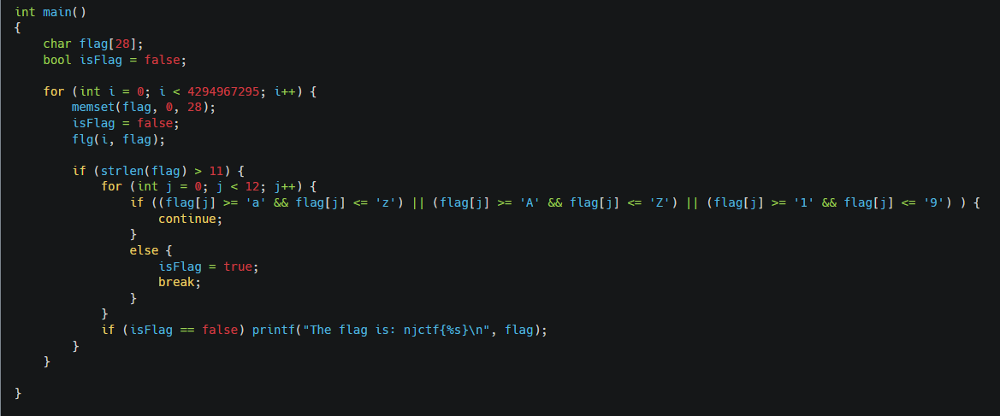

Đoạn code trên xử lý tất cả các giá trị i đầu vào thay thế cho v43 và bruteforce những flag có thể có. Tuy vậy, ta cần phải thử các giá trị flag này và ước tính có khoảng hơn 300 flag khác nhau được in ra và có lẽ chưa đến nỗi bất khả thi.

\- Flag: **Đoán xem**
