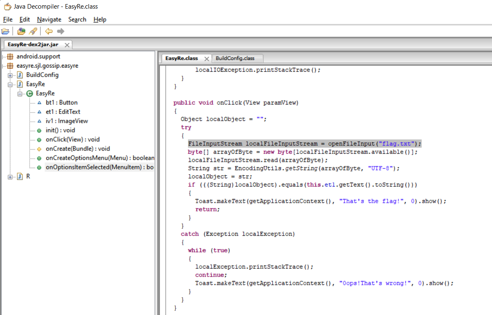
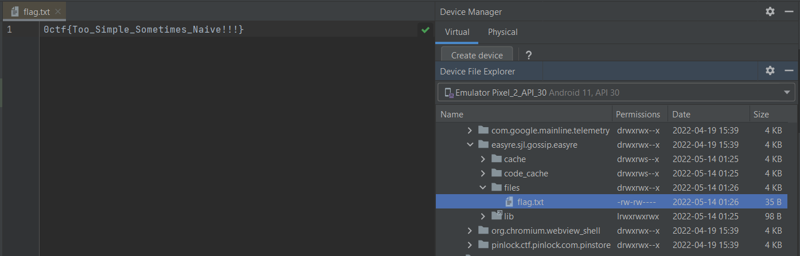

# WRITE UP

**Challenge:** EasyRE

Sử dụng công cụ Java Decompiler để có thể reverse được code:

Ta có thể đọc được dòng

*FileInputStream localFileInputStream = openFileInput("flag.txt");*

Đến đây, ta tiến hành install vào Emulator Android và tìm kiếm thư mục của app, ta tìm được flag.txt tại **/data/data/easyre.sjl.gossip.easyre/files/flag.txt:**

\- Flag: \*\*\*\*\*\*\*\*\*\*\*\*\*\*\*\*\*\*\*\*\*\*\*\*\*\*\*\*\*\*\*\*\*\*\*\*\*\*\*\*\*\*
