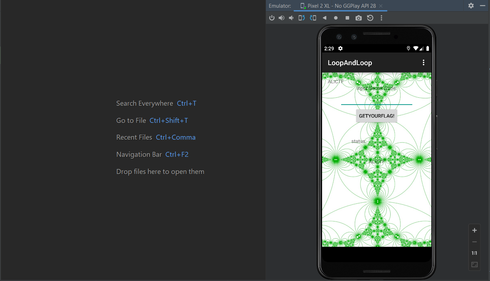
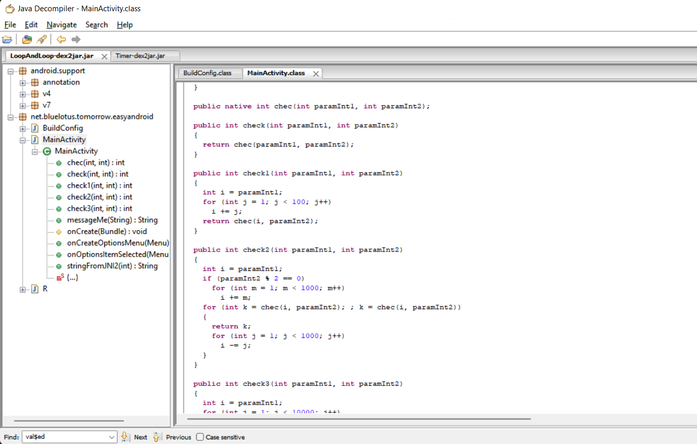
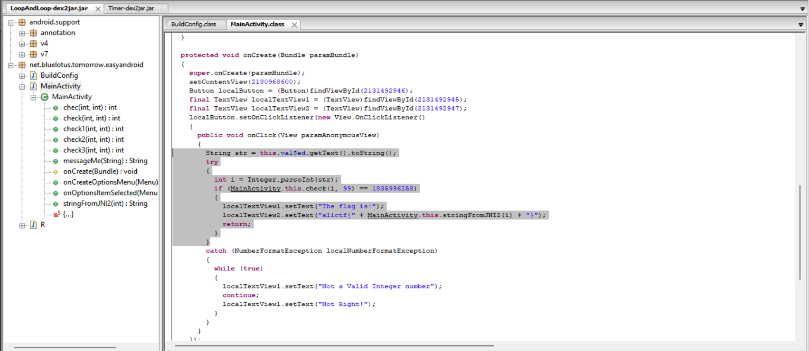
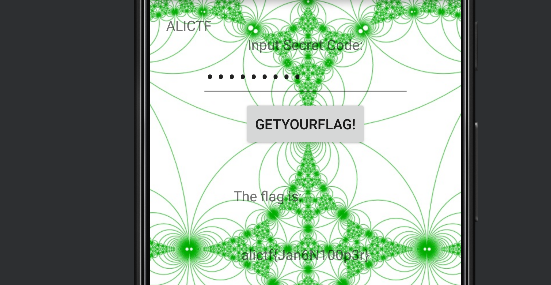

# WRITE UP

**Challenge:** LoopAndLoop.apk

Sử dụng JD-GUI view sources:

 Flow của chương trình như sau: App đọc input của người dùng Bỏ vô hàm check để kiểm tra Nếu check(par1, par2) == 1835996258 In flag.

Trong hàm check sẽ là loop giữa các hàm check, check1, check2 và check3. Công việc của ta là RE lại hoặc sử dụng cách tương tự để in ra được par1 phù hợp với điều kiện. Code bruteforce:

def check(par1, par2):

    if par2 &lt;= 1:

        return par1

    if 2 \* par2 % 3 == 0:

        return check1(par1, par2 - 1)

    elif 2 \* par2 % 3 == 1:

        return check2(par1, par2 - 1)

    else:

        return check3(par1, par2 - 1)

def check1(par1, par2):

    i = par1

    for j in range(1, 100):

        i += j

    return check(i, par2)

   

def check2(par1, par2):

    i = par1

    if par2 % 2 == 0:

        for m in range(1, 1000):

            i += m

        return check(i, par2)

    for m in range(1, 1000):

        i -= m

    return check(i, par2)

def check3(par1, par2):

    i = par1

    for j in range(1, 10000):

        i += j

    return check(i, par2)

cond = 1835996258

intValue = 236495000 \#guest value till near cond value

for i in range(intValue, 0, -1):

    checkValue = check(i, 99)

    print(checkValue)

    if (checkValue == cond):

        print("The flag is: " + str(i))

        break

Kết quả:

Par1 = **236492408**

Nhập vào app và nhận flag:

\- Flag: \*\*\*\*\*\*\*\*\*\*\*\*\*\*\*\*\*\*\*\*\*\*\*\*\*\*\*
