# WRITE UP

Challenge: Timer.apk

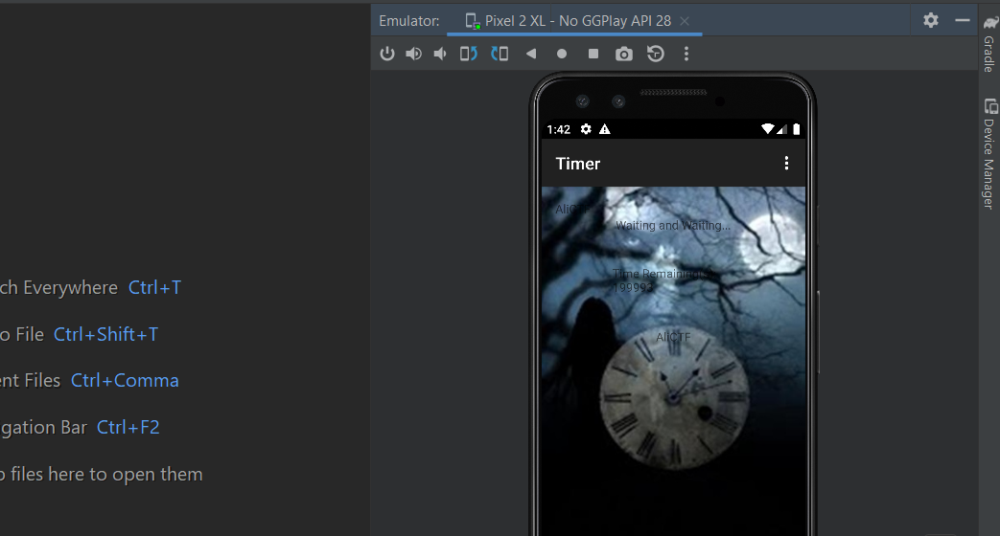

Cài đặt ứng dụng và mở lên thì thấy đây là một application cho ta chờ đợi. Có lẽ hết thời gian thì sẽ nhả flag. Mà bao giờ thì không biết. Sử dụng JD-GUI để xem mã giả:

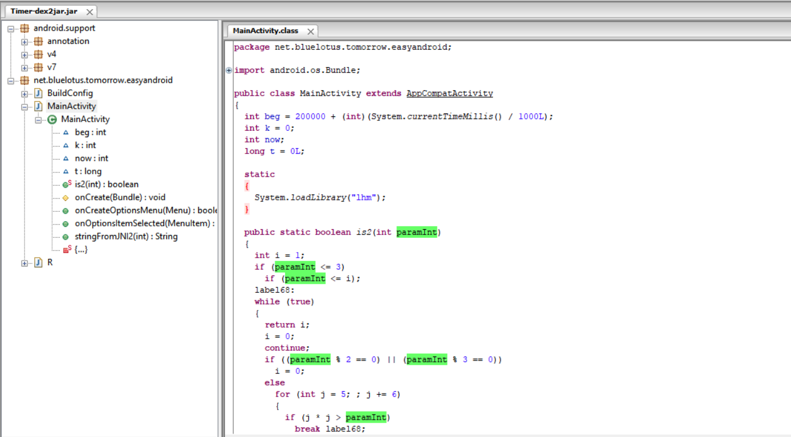

MainActivity khởi tạo các giá trị beg, k, now,t. Có hàm check isPrime():  
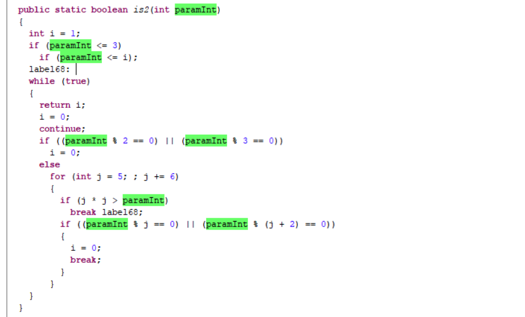

Ở hàm OnCreate(), localHandler sẽ gọi postDelayed với class Runnable(). Trong đây, **this.t** sẽ được set bằng thời gian thực:

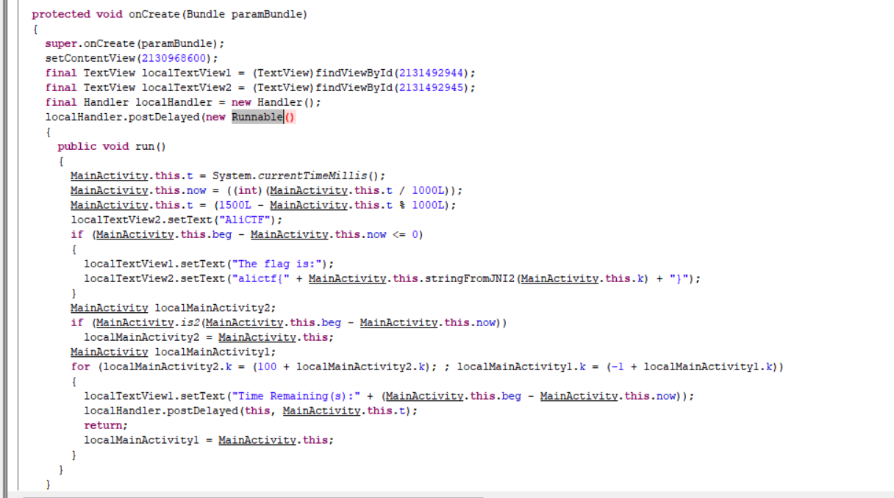

Để đọc được flag, **this.beg** phải &lt;= **this.t**, nhưng không dễ như vậy. **this.beg** được gán = 200000 + currentTime:

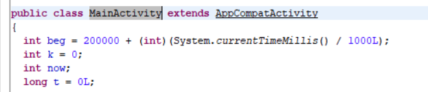

Bên cạnh đó, ở bên dưới mỗi khi if trả về false, chương trình lại đệ quy gọi lại postDelayed(). Lúc này giá trị **this.k** được modify **this.k += 100** đồng thời biến count làm **this.k -= 1.** Mà giá trị **this.k** là input stringFromJNI2() – hàm để get flag ra:

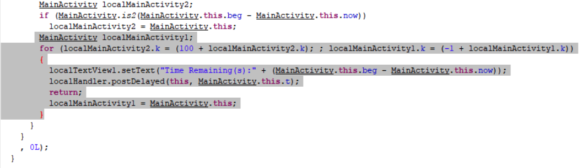

Giờ thì ta cần modify nó để bypass cái if này và gán k bằng giá trị phù hợp sau khi chạy qua 200000 giây:

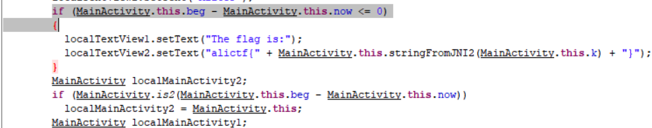

MainActivity sẽ gọi is2() (isPrime()) để kiểm tra thời gian có phải là prime hay không trước khi vào vòng for biến đổi giá trị k và thực hiện đệ quy bên trong đó. Do đó, ta sử dụng python để tìm ra giá trị k cuối cùng khi chạy qua đoạn mã giả bên trên. Ta tìm được **k = 1616384 (0x18aa00):**

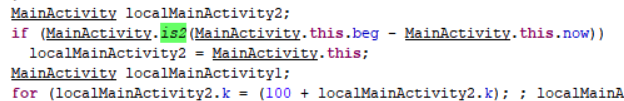

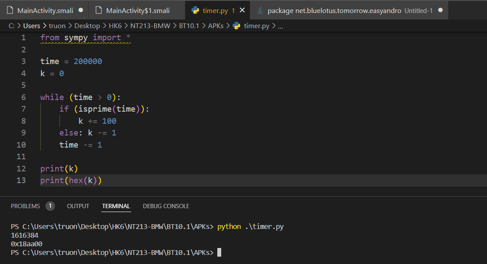

Đoạn cần modify là đoạn bên dưới đây. Ta sẽ modify giá trị của k ngay khi khai báo với giá trị hex 0x18aa00. Sử dụng apktool để build soure ra smali. Ta sẽ modify trong MainActivity.smali:

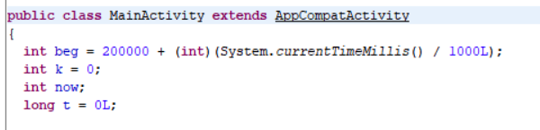

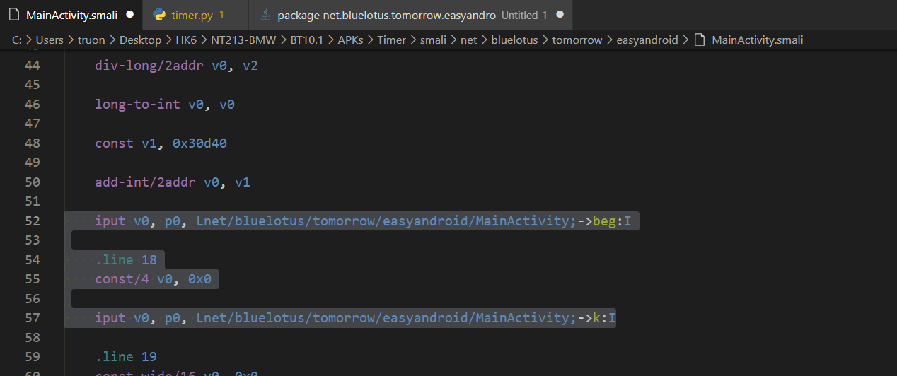

const/4 v0, 0x0 ( int k = 0) const/4, 0x18aa00 ( int k = 1616384)

Tiếp theo, ta cần modify &lt;= ở if so sánh để đọc được flag thành &gt;. Tuy vậy, khi move vào runnable(), ta chỉ thấy smali invoke-virtual đến postDelayed(Ljava/lang/Runnable;j)Z:

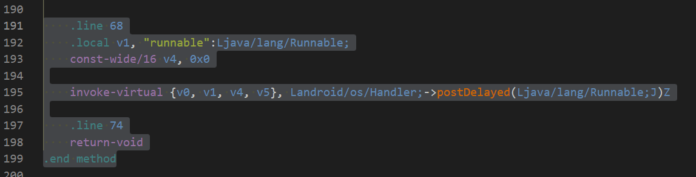

Check lại source, ta thấy còn 1 file alf MainActivity$1.smali, mở lên thì đó là **Ljava/lang/Runnable:**

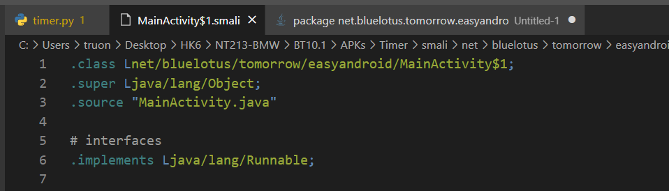

Tìm kiếm chuỗi “AliCTF” vì bên dưới nó sẽ là đoạn if cần modify:

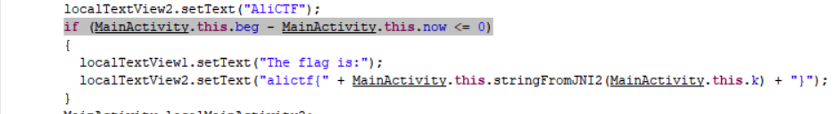

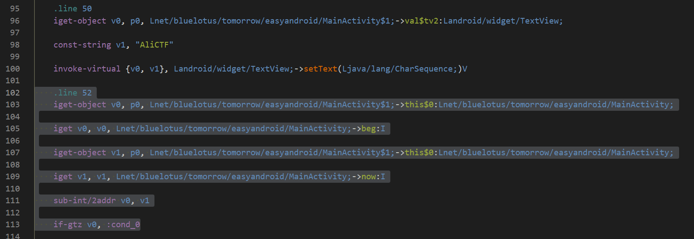

Ở cuối dòng 52, MainActivity gọi if-gtz (nếu lớn hơn hoặc bằng) so sánh v0 với :cond\_0 (ở đây là so sánh this.beg với this.now). Do đó, ta sẽ modify trực tiếp v0 trước khi gọi if-gtz. Ta đổi từ **if-gtz** **if-ltz** (nhỏ hơn):

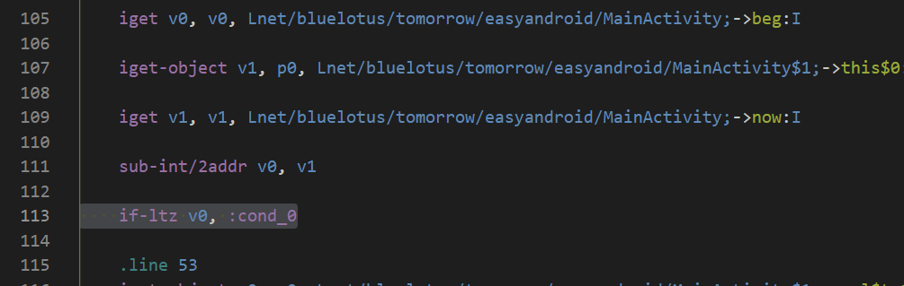

Rebuild lại app:

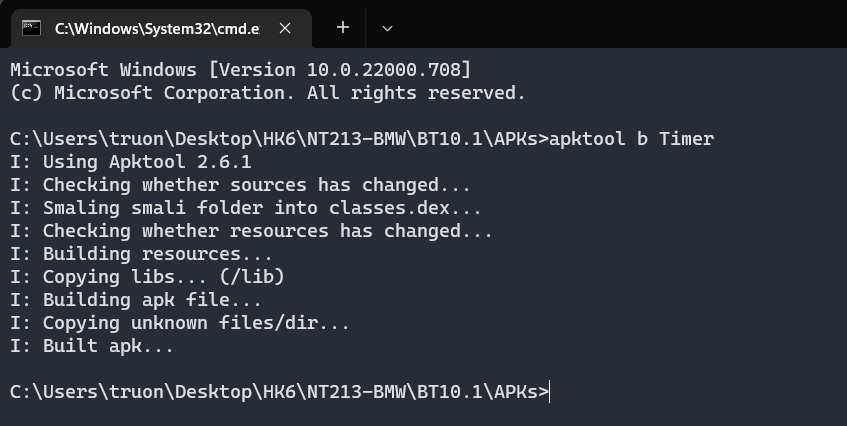

Generate keytool:

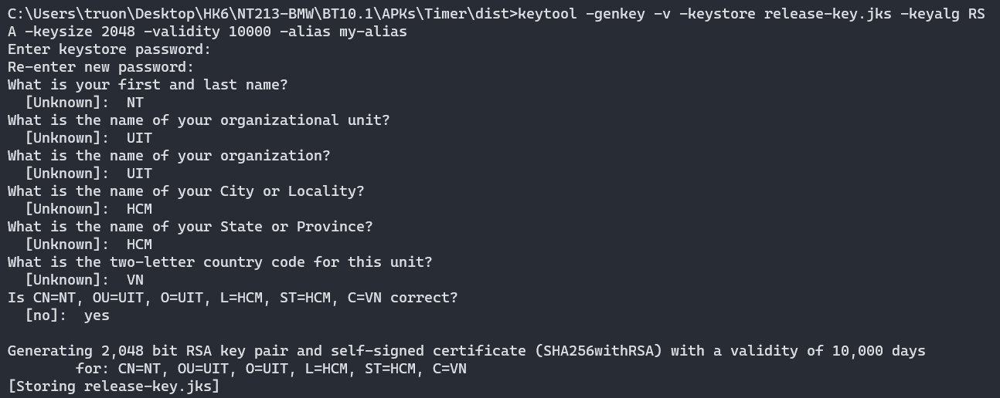

Align lại file apk:

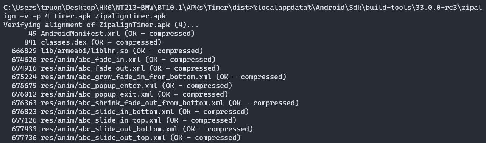 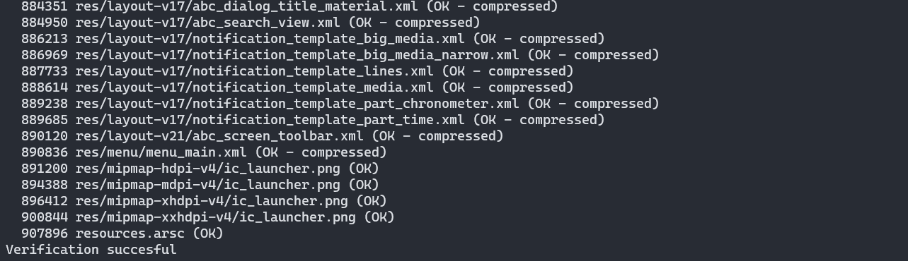

Sign cho app vừa aligned:

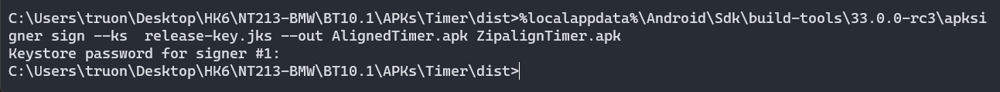

Mở app lên và ta get được flag:

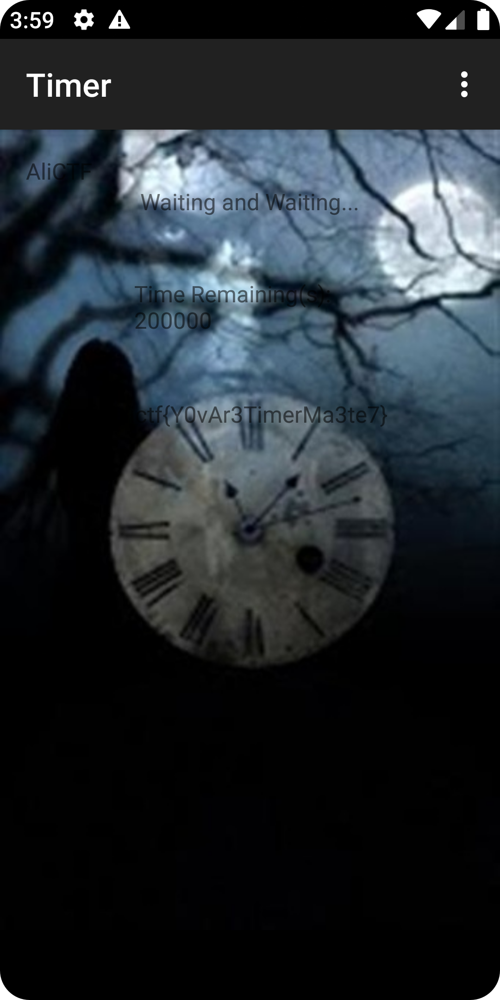

\- Flag: \*\*\*\*\*\*\*\*\*\*\*\*\*\*\*\*\*\*\*\*\*\*\*\*\*\*\*\*\*\*\*\*
