# WRITE UP

**Challenge:** mobicrackNDK

Sử dụng công cụ Java Decompiler để có thể reverse được code:

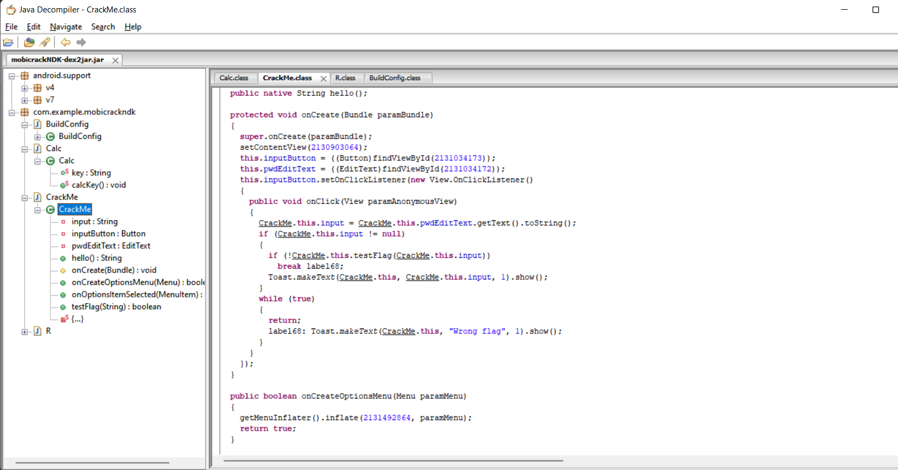

Ta thấy, có 2 class là CrackMe và Calc. CrackMe nhận input và sử lý so sánh bằng hàm testFlag. Cacl tính toán một giá trị string reverse để làm cái gì đó.

Extract source code với apktool, ta thấy được một file **libmobicrackNDK.so,** sử dụng IDA để phân tích.

Ứng dụng sẽ load JNI bằn hàm JIN\_Onload(), gọi hàm off\_400C để thực thi với fastcall:

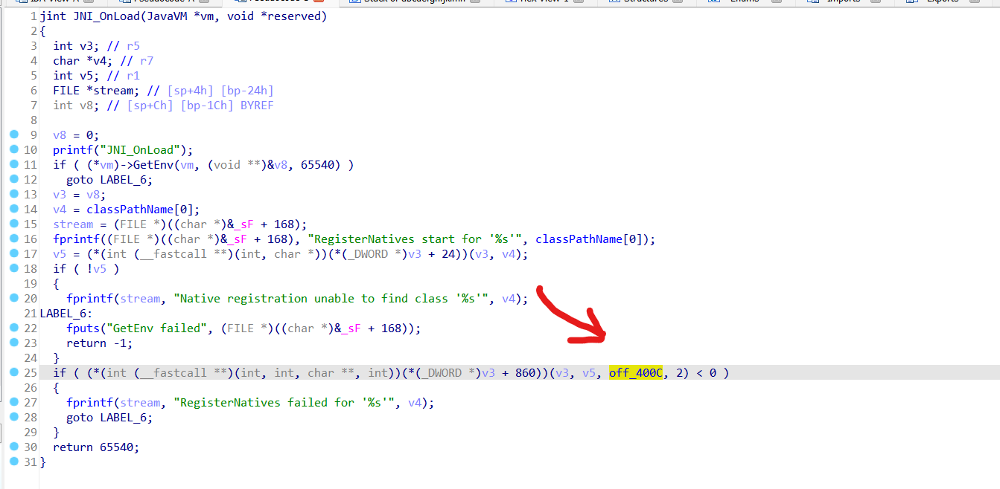

off\_400C sẽ thực thi hàm **testFlag**, bên dưới nó có một hàm là **abcdefghijklmn:**

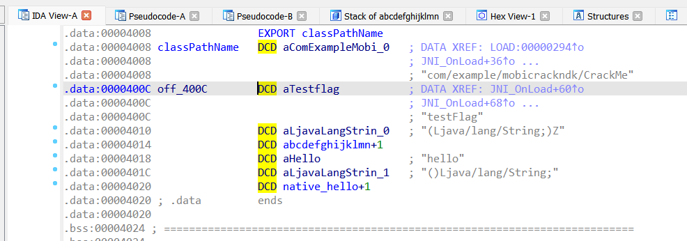

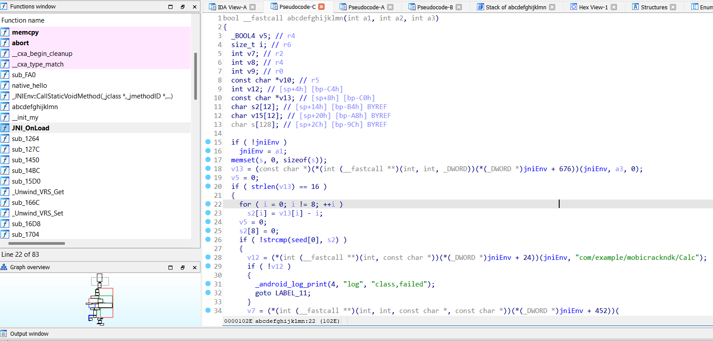

Hàm **abcdefghijklmn** sẽ thực hiện các bước để so sánh tìm ra đúng. Phân tích hàm thấy:

-   Trong hàm có sử dụng v13 để nhận giá trị đầu vào từ a3.

-   Đây là hàm boolean, cuối hàm, biến trả về được gán bằng giá trị của hàm strcmp(v15, v10).  
    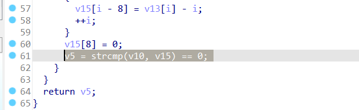

-   Trước đó, chuỗi đầu vào v13 sẽ được xử lý qua vòng lặp for (length == 8). Sau đó, được so sánh với mảng seed. Nếu false, nó sẽ đi đến LABEL\_11 và ở đây exit(). Nếu true, chương trình thực hiện gọi hàm **calcKey()** và g:  
    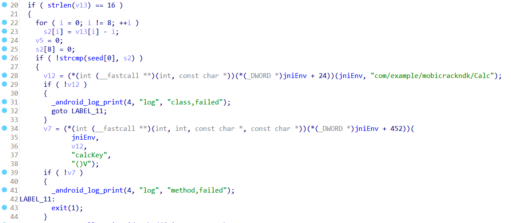

-   Mảng seed là một giá trị được khai báo có giá trị **QflMn\`fH**:  
    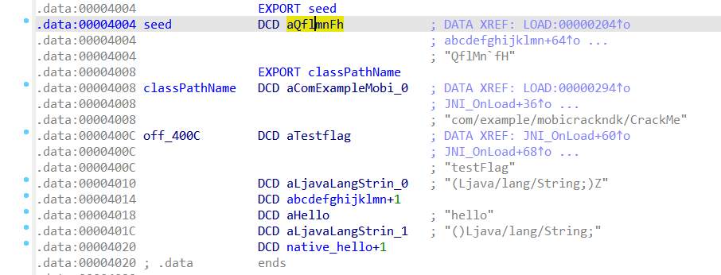

-   Hàm calcKey() sẽ được gọi nếu true, sau đó, giá trị key chương trình sẽ get giá trị key:  
    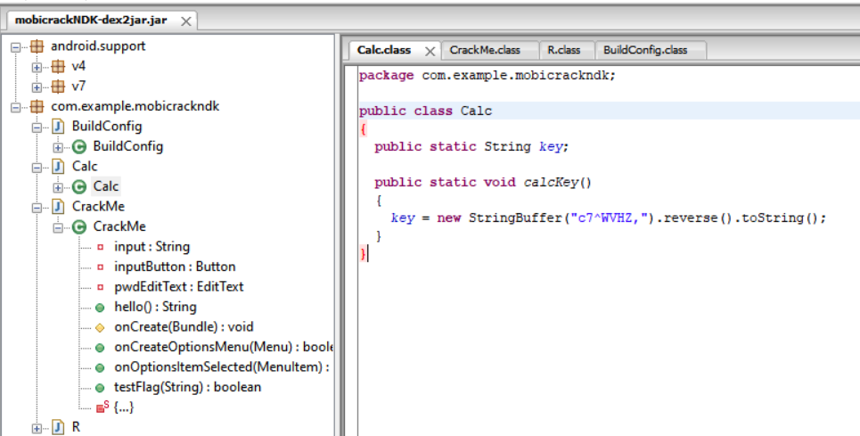  
      
    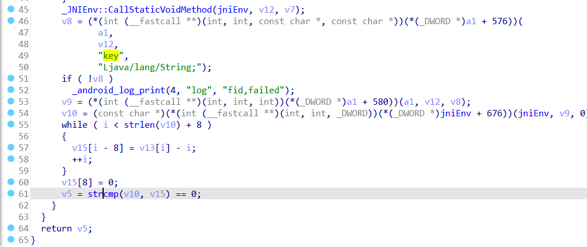

-   Quay xuống bên dưới, v10 sẽ phụ trách nhận giá trị sau khi get key từ calcKey() (được xử lý qua v8 và v9). Lúc này, length(v10) == 8 (nhận key từ calcKey). Do vòng lặp for phía bên trên có cấp bậc cao hơn và vòng lặp while chỉ được thực thi khi và chỉ khi giá trị **strcmp(seed\[0\], s2) là true**, mà để là true thì ít nhất length(s2) == length(seed\[0\]) i == 8.

-   Khi i == 8, vòng lặp while (i &lt; strlen(v10) + 8) for (i == 8; i &lt;16; ++i):  
    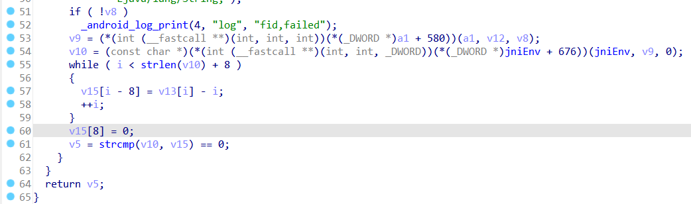

-   Vậy seed\[0\] lúc này có giá trị như nào? Dò tìm trong các hàm, ta thấy hàm \_\_init\_my() có xử lý seed\[0\]. Ở đây, \_\_init\_my() sẽ được load khởi tạo. Từ đó, seed\[0\] được xử lý bằng:  
    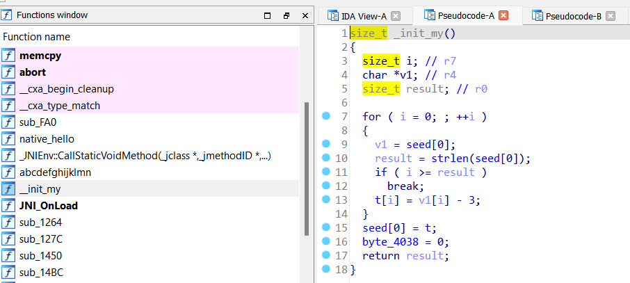

> Từ các phân tích trên ta có:

-   Flag sẽ là chuỗi length == 16

-   Trong Flag sẽ có seed và key. Seed sẽ được xử lý qua thuật toán ở \_\_init\_my(), key sẽ được reverse qua hàm calcKey():

> Ta có script python để get được đoạn flag cho ra v5 == true:  
> 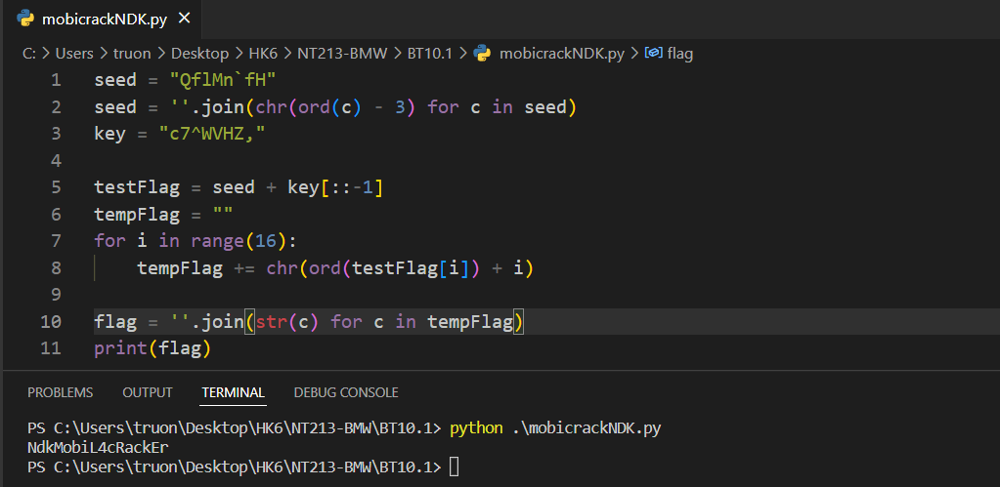

\- Flag: \*\*\*\*\*\*\*\*\*\*\*\*\*\*\*\*\*\*\*\*\*\*\*
